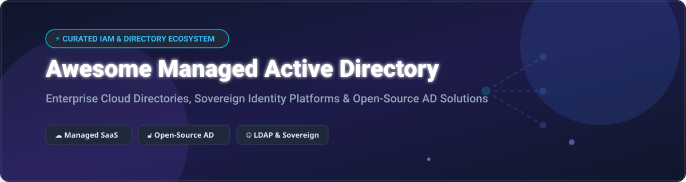

# Awesome Managed Active Directory Service 🔐

  
  
  
  

## 🚀 Top Managed Active Directory & Identity Service Ecosystem

**A Curated List of Managed Directory SaaS Platforms, Cloud Identity Providers (IdP), and Open-Source Active Directory Alternatives.**

*Focused on Managed Directory Services, Identity Governance & Administration (IGA), Sovereign IAM Platforms & Self-Hosted AD-Compatible Directory Alternatives.*

**Last updated: October 2026** 📅

---

### 💡 Overview & SEO Keywords
Whether you are architecting enterprise workforce identity, migrating legacy Windows Server Active Directory Domain Services (AD DS) to the cloud, or establishing zero-trust access control with sovereign open-source LDAP servers, this repository serves as a definitive guide to commercial SaaS providers and self-hosted open-source Active Directory software.

Key focus areas: **Active Directory (AD)**, **Managed Directory Service**, **Identity & Access Management (IAM)**, **Single Sign-On (SSO)**, **Multi-Factor Authentication (MFA)**, **LDAP / LDAPS**, **Kerberos Authentication**, **Role-Based Access Control (RBAC)**, and **Digital Sovereignty**.

---

## 📌 Table of Contents
- [☁️ SaaS & Cloud Managed Directory Platforms](#-saas--cloud-managed-directory-platforms)
- [🔓 Open-Source Active Directory & Directory Servers](#-open-source-active-directory--directory-servers)
- [🤝 How to Contribute](#-how-to-contribute)
- [💖 Support](#-support)
- [📈 Star History](#-star-history)
- [⚠️ Disclaimer](#%EF%B8%8F-disclaimer)

---

## ☁️ SaaS & Cloud Managed Directory Platforms

### 📊 Market Size & Industry Dynamics
The global Identity and Access Management (IAM) and Cloud Directory Services market is estimated at **$18.5 Billion (2026)** and is projected to reach **$34+ Billion by 2030**. 

The sector is **moderately concentrated** among mega-cap tech giants (Microsoft Entra ID, Google Workspace, AWS) and specialized identity platforms (Okta), while remaining fragmented across mid-market enterprise identity, customer IAM (CIAM), and regional compliance-focused directory providers.

> [!NOTE]
> Platforms are ordered by **Company Scale / Market Capitalization (Descending)**.

| SaaS Platform 🏢 | Enterprise Market Scale / Valuation 💰 | Starting Pricing 💵 | Free Tier / Free Trial Limits 🎁 | Primary Use Case & Best For 🎯 |
| :--- | :--- | :--- | :--- | :--- |
| **[Google Workspace Directory](https://workspace.google.com/)** 🌐 | ~$2.15 Trillion (Parent Alphabet Inc.) | $6.00 / user / month (Business Starter) | 14-day free trial (up to 10 users) | Google ecosystem workforce identity & SSO |
| **[Microsoft Entra ID](https://www.microsoft.com/en-us/security/business/identity-access/microsoft-entra-id)** 🪟 | ~$3.10 Trillion (Parent Microsoft Corp) | $7.00 / user / month (P1 Standalone) | Free forever (up to 50,000 directory objects & unlimited SSO) | Microsoft-centric enterprise cloud directory |
| **[AWS Directory Service](https://aws.amazon.com/directoryservice/)** ☁️ | ~$1.95 Trillion (Parent Amazon.com) | $0.05 / hour (~$36/month for Small AD) | 30-day free trial (750 hours of AWS Managed Microsoft AD) | AWS-native cloud workloads & hybrid AD connection |
| **[Okta Universal Directory](https://www.okta.com/products/universal-directory/)** 🔑 | ~$31.8 Billion Market Cap | $6.00 / user / month (Workforce Identity) | 30-day enterprise free trial | Independent multi-tenant enterprise cloud directory |
| **[Auth0](https://auth0.com/)** 🔐 | $6.5 Billion (Acquired by Okta) | $23.00 / month (B2C Essentials) | Free forever (up to 25,000 Monthly Active Users / MAUs) | Developer-centric customer identity & authentication |
| **[JumpCloud](https://jumpcloud.com/)** 💻 | ~$2.6 Billion Valuation | $3.00 / user / month (Platform Core) | 30-day free trial (full platform features for up to 10 users) | SMB cloud directory, OS management & LDAP-as-a-Service |
| **[Ping Identity](https://www.pingidentity.com/)** 🛡️ | $2.8 Billion (Acquired by Thoma Bravo) | $3.00 / user / month (Enterprise Quote) | 30-day enterprise evaluation trial | Large enterprise hybrid IAM & governance |
| **[OneLogin](https://www.onelogin.com/)** 🚪 | ~$500 Million (Acquired by One Identity) | $2.00 / user / month (Advanced SSO) | 30-day unrestricted free trial | Mid-market enterprise SSO & unified directory |
| **[ManageEngine ADManager Plus](https://www.manageengine.com/)** 🛠️ | Private (Subsidiary of Zoho Corp, $1B+ Rev) | $595.00 / year (Standard Edition, 100 domain objects) | Free Edition forever (up to 100 domain objects) | Windows Active Directory management, auditing & automation |
| **[Frontegg](https://frontegg.com/)** ⚛️ | ~$180 Million Valuation (Series B) | $99.00 / month (Growth Plan) | Free forever (up to 7,500 Monthly Active Users / MAUs) | B2B SaaS multi-tenant user management & RBAC |

---

## 🔓 Open-Source Active Directory & Directory Servers

> [!TIP]
> Open-source directory solutions are ordered by **GitHub Stars_Count (Descending)**.

- **[Keycloak](https://github.com/keycloak/keycloak)**  🔐  
  **Open-Source Identity and Access Management for Modern Applications**, Apache-2.0 licensed. Provides SSO, User Federation (LDAP & Active Directory integration), OpenID Connect, SAML 2.0, and fine-grained authorization services. **Best for cloud-native IAM and application SSO.**

- **[Authelia](https://github.com/authelia/authelia)**  🛡️  
  **The Single Sign-On Multi-Factor portal for web applications**, Apache-2.0 licensed. Companion to reverse proxies (Traefik, NGINX, Caddy) offering 2FA (TOTP, WebAuthn) and LDAP identity provider integration. **Best for self-hosted home lab & SMB reverse proxy authentication.**

- **[Authentik](https://github.com/goauthentik/authentik)**  ⚡  
  **The open-source Identity Provider focused on flexibility and security**, GPL-3.0 licensed. Built-in support for OAuth2, SAML, LDAP Server interface, and customizable authentication flows with Python expression policies. **Best for modern enterprise open-source IdP.**

- **[FreeIPA](https://github.com/freeipa/freeipa)**  🐧  
  **Integrated Identity and Authentication solution for Linux/Unix environments**, GPL-3.0 licensed. Combines 389 Directory Server, MIT Kerberos, Dogtag PKI, and Samba for cross-forest trusts with Microsoft Active Directory. **Best for Linux-centric domain identity & AD trusts.**

- **[Samba](https://github.com/samba-team/samba)**  🪟  
  **The premier open-source implementation of SMB and Active Directory protocols**, GPL-3.0 licensed. Functions directly as a full Active Directory Domain Controller (AD DC) with Kerberos KDC, LDAP server, and DNS services. **Best for drop-in open-source Windows AD domain controller replacement.**

- **[OpenLDAP](https://github.com/openldap/openldap)**  🗄️  
  **The high-performance open-source LDAP directory suite**, OpenLDAP Public License. Industry-standard reference C implementation offering robust multi-master replication and extreme throughput. **Best for high-performance enterprise LDAP infrastructure.**

- **[midPoint](https://github.com/Evolveum/midpoint)**  📊  
  **Comprehensive open-source Identity Governance and Administration (IGA) platform**, Apache-2.0 / EUPL licensed. Advanced identity provisioning, role mining, automated lifecycle sync, and regulatory compliance (GDPR, NIS2, ISO 27001). **Best for enterprise identity governance & synchronization.**

- **[389 Directory Server](https://github.com/389ds/389-ds-base)**  🏢  
  **Enterprise-class LDAP server from Red Hat**, GPL-3.0 licensed. Supports multi-master replication, Active Directory synchronization, and serving as the LDAP foundation for FreeIPA. **Best for enterprise-grade LDAP with AD sync.**

- **[ApacheDS](https://github.com/apache/directory-server)**  ☕  
  **Extensible Java-based LDAP and Kerberos directory server**, Apache-2.0 licensed. Certified LDAPv3 server managed via Apache Directory Studio. **Best for cross-platform Java environments.**

- **[LSC-Project (LDAP Synchronization Connector)](https://github.com/lsc-project/lsc)**  🔄  
  **Identity synchronization connector engine**, Apache-2.0 licensed. Connects and synchronizes data between LDAP directories, Active Directory, SQL databases, and web services. **Best for directory data migrations & continuous sync.**

- **[Univention Nubus](https://www.univention.com/solutions/alternative-to-microsoft-active-directory/)** 🏛️  
  **Sovereign Identity & Access Management alternative to Microsoft Entra ID**, open-source software. Containerized on Kubernetes with SAML, OIDC, and LDAP interfaces for sovereign public sector and enterprise deployments. **Best for sovereign IAM and AD-compatible cloud identity.**

---

## 🤝 How to Contribute

Contributions are warmly welcomed! 🌟 To add or update directory platforms:

1. Fork the repository 🍴
2. Add/edit entries in `README.md` (ensure table or star-sorted format is maintained) ✍️
3. Submit a Pull Request (PR) with factual references 📬

---

## 💖 Support

If you find this repository helpful for your identity architecture or system administration work:
- ⭐ **Star** this repository to show support!
- 🔀 **Fork** it to keep a copy for your reference!
- ☕ **Buy me a coffee**: Support ongoing open-source maintenance via the [GitHub Sponsor Dashboard](https://github.com/sponsors/ishandutta2007)!

Thank you to all contributors and community supporters! ❤️

---

## 📈 Star History

---

## ⚠️ Disclaimer

- This repository is a **community-curated list** provided for educational and informational purposes.
- Identity and directory platforms manage critical authentication credentials and access privileges. Ensure production deployments undergo thorough security audits, penetration testing, and compliance verification.
- License specifications and pricing details are accurate as of October 2026 but are subject to vendor changes.

---

**Made with ❤️ for system administrators, IAM architects, and DevOps engineers.** 🚀
